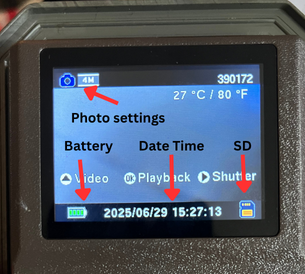
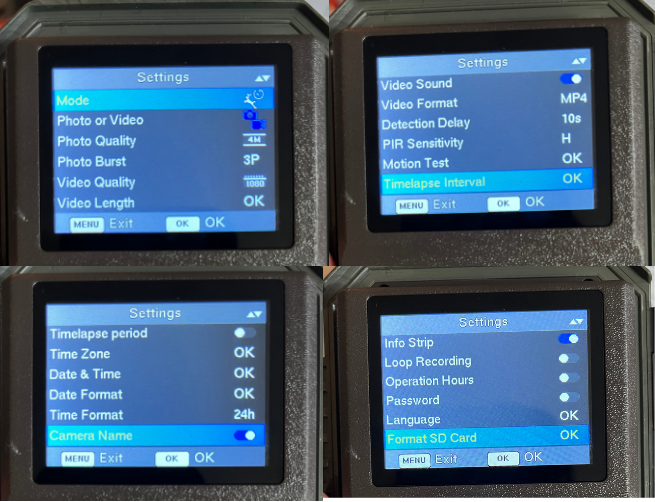
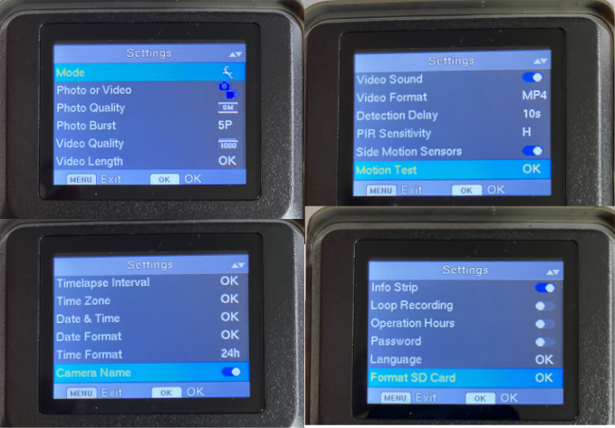

# Camera Trap Data Collection Protocol
*Adapted from fieldwork protocols developed by the Koa team for the 2025 Experiential Introduction to AI and Biodiversity course, in collaboration with NEON, ABC Center, and Imageomics.*

## Pre-deployment Preparation
- Format SD cards in camera traps before deployment
- Label SD cards and camera traps with unique IDs
- Charge batteries and pack spares
- Access Jotform for data entry: [Camera Trap Data Form](https://form.jotform.com/251744693796070), with a paper backup

## Equipment Checklist
- Camera traps with paired SD cards
- Zip ties for mounting to fence posts and trees

## Camera Configuration

   - Turn camera on by sliding the power switch to the “ON” position
   - Confirm date and time are correct on the camera display, battery level is sufficient, and SD card is properly inserted. See photos below for reference.

| Camera Trap ID      | Trap Model             | Configuration Steps                                                                                                                                                                                             | Motion Test                                                                                                                                                                          | Notes                          |
|---------------------|------------------------|------------------------------------------------------------------------------------------------------------------------------------------------------------------------------------------------------------------|--------------------------------------------------------------------------------------------------------------------------------------------------------------------------------------|--------------------------------|
| CT01, CT02      | Garde Pro T5NG | Mode: Hybrid, Photo (4MP, 3P), Video (1080, 10 sec, Sound, MP4), High PIR, Timelapse photo every hour, Timezone USA Eastern, Y/M/D, 24-hour time, Info strip ON, Loop recording and Operating Hours OFF    | Click on MENU and navigate to "Motion Test" option. Make movements in front of the camera at several positions where the animals are expected to pass (if possible to do safely). When the white motion indicator LED flashes in RED, it indicates the camera is able to send the position. Review the photos to ensure the camera is capturing images correctly. |      256GB SD                          |
| CT03              | Garde Pro A3            | Photo (8MP, 3 photos in series) & Video (1920X1080P, 10s, Audio ON), Shot lag 10s, Side motion sensors ON, Sensor Level High, Target recording time OFF, Time lapse ON & 1 Hour interval, 24-hour time, yy/mm/dd, Photo stamp time and date | Use 'Aim' switch to preview image capture  |          32GB SD                      |
| CT04              | Trail Camera G600      | Mode: Motion detection, Photo (8M, 5P) & Video (1080, 10sec, Sound, MP4), 10s detection delay, High PIR, Side Motion Sensors enabled, Timezone USA Eastern, Y/M/D, 24-hour time, Info strip ON, Loop recording and Operating Hours OFF | Switch to 'Set'. Click 'Menu' button, navigate to 'Motion Test'. Click 'Ok'. Set camera up to capture images for a few minutes. Preview photos to ensure the camera is capting images correctly. If it looks good, toggle to 'On' mode. | 32GB SD, Hybrid mode not available  |                                

## Camera Trap Deployment
### Site Selection & Setup

   - Ensure site is accessible and safe for equipment deployment
   - Turn on the camera by sliding the power switch to the “ON” position.
   - Mount the camera on a sturdy tree with a diameter of about 6 inches (15 cm). The tree should be a minimum of approximately 16-17 feet (5 metres) from the area to be monitored to ensure proper focus is obtained.
   - Adjust the height of the camera to be 2.5-3.5 feet (0.75-1 meter) above the ground. This will ensure that the camera can capture the whole body of most animals.
   - Adjust the camera angle to 0-15 degrees. This will ensure that the camera is facing the area you want to monitor. If the angle is too large, the shooting distance will be too close and the camera may not be able to focus correctly, resulting in a blurred or unclear shot.
   - Make sure that the front of the camera is not blocked by any branches, leaves, or other objects. This will ensure that the camera can sense and shoot the animals clearly. Note that night photography works best when the subject is within the desired flash range. If there are lights too close to the camera, overexposure of the image contents may occur.
   - **Perform Motion Test and validate images are captured correctly.**
   - Tie pink flagging tape to indicate the location of the camera trap.
   - Photograph the camera trap with the ID visible, and record GPS coordinates in the field notebook.
   - Record deployment details in Jotform and field notebook, and back up CSV to OSC.

### Regular Maintenance Protocol

#### Camera Trap SD Card Replacement

1. Approach camera and record location ID in field notebook
2. Wave hand in front of camera to mark end of collection period
3. Turn camera off (slide switch to bottom position)
4. Remove SD card and record:
   - Camera ID
   - SD card ID
   - Date and time removed
   - Battery status
5. Insert fresh SD card from paired set
6. Record new SD card ID
7. Turn camera on and set current date/time
8. Wait 15 seconds for initialization (red light stops flashing)
9. Test trigger with hand wave

#### Equipment Checkslist
- Remove spider webs and debris from lens and sensor
- Check battery level (replace if low/dead)
- Tighten mounting if loose
- Verify detection zone is clear

## Troubleshooting
- No photos: Check battery, SD card seating, detection settings
- Blurry images: Clean lens, check for condensation
- Inconsistent triggering: Adjust sensitivity, clear detection zone

## Resources
[GardePro T5NG Trail Camera Instruction Manual](https://cdn.shopify.com/s/files/1/1065/8354/files/7700-SMA230-105_GardePro_T5NG_Instruction_Manual_v1.1_20230629_Timelapse_period.pdf?v=1702485065)

[How to Properly Set Up a Camera Trap](https://help.gardepro.com/docs/How-to-Install-the-Camera-Properly)

## Photos
Camera trap power switch and display

GardePro T5NG (CT-001, CT-002)

Trail Camera G600 (CT-004)

---

*This protocol should be reviewed and updated based on site-specific conditions and research objectives at The Wilds.*